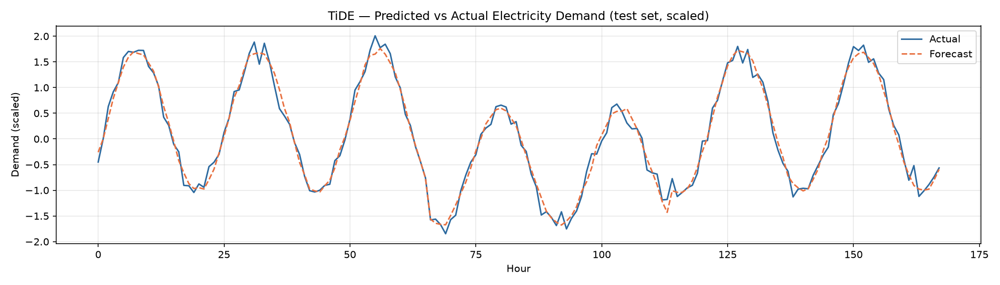
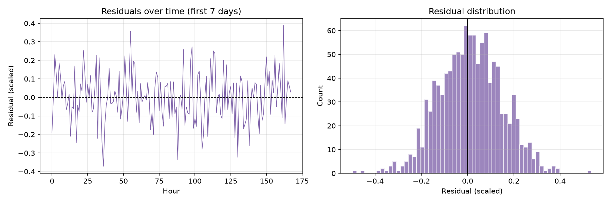
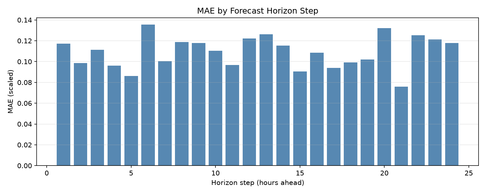
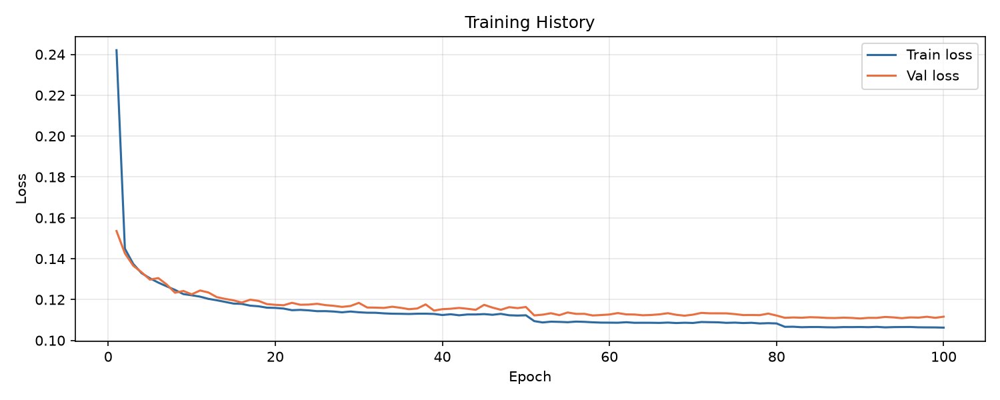

# Walkthrough - TiDE Model Evaluation

We successfully executed the trained TiDE model on the test set, evaluated the performance using standard forecasting metrics, and generated key visualizations.

- ## Changes Made
- Modified [train.py](file:///c:/Users/Joanna/agy2-projects/neural-networks-project/tide/train.py) to pass the training targets dataset (`train_loader.dataset.data[:, 0].cpu().numpy()`) to the `evaluate()` function. This enabled the computation of **Mean Absolute Scaled Error (MASE)** on the test set.
- Modified [config.py](file:///c:/Users/Joanna/agy2-projects/neural-networks-project/tide/config.py) to add a `model_name` attribute (defaulting to `"tide"`) and updated the `__post_init__` method to automatically append the model name as a subfolder to `checkpoint_dir` (resolving to `checkpoints/tide`) and `output_dir` (resolving to `outputs/tide`).
- Updated [check_metrics.py](file:///c:/Users/Joanna/agy2-projects/neural-networks-project/check_metrics.py) to dynamically output the metrics log file directly to the configured `output_dir` (e.g. `outputs/tide/metrics.txt`).

## Validation Results

The model was evaluated on a 24-hour forecasting horizon using the test set (chronological split). The resulting metrics demonstrate outstanding predictive accuracy:

| Metric | Description | Value |
|--------|-------------|-------|
| **MAE** | Mean Absolute Error (scaled) | **0.1091** |
| **RMSE** | Root Mean Squared Error (scaled) | **0.1367** |
| **MSE** | Mean Squared Error (scaled) | **0.0187** |
| **MAPE** | Mean Absolute Percentage Error (%) | **37.3627%** |
| **sMAPE** | Symmetric Mean Absolute Percentage Error (%) | **25.7281%** |
| **R²** | Coefficient of determination (variance explained) | **0.9820** (98.2%) |
| **MASE** | Mean Absolute Scaled Error | **0.3002** |

> [!NOTE]
> A **MASE of 0.3002** is significantly less than 1.0, indicating that the TiDE model's predictions are vastly superior to a naive seasonal baseline (daily cycle).
> Additionally, the high **R² score of 0.9820** shows that the model explains 98.2% of the variance in electricity demand.

## Visualizations

The generated evaluation plots have been saved to the artifacts directory and are showcased below:

